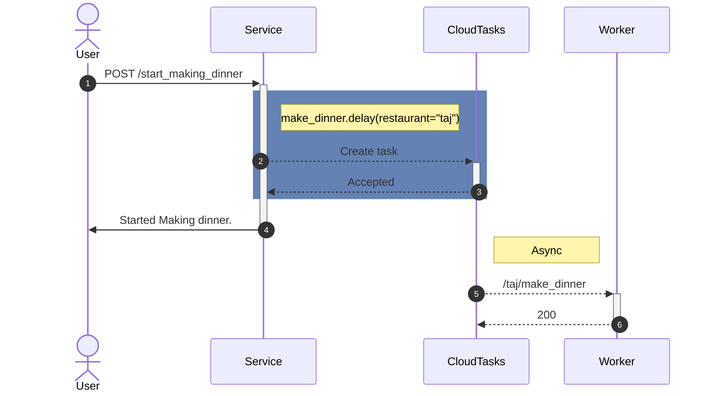

# FastAPI Cloud Tasks

Strongly typed background tasks with FastAPI and Google CloudTasks.



## Installation

```
pip install fastapi-cloud-tasks
```

## Key features

- Strongly typed tasks.
  - Fail at invocation site to make it easier to develop and debug.
  - Breaking schema changes between versions will fail at task runner with Pydantic.
- Familiar and simple public API
  - `.delay` method that takes same arguments as the task.
  - `.scheduler` method to create recurring job.
- Tasks are regular FastAPI endpoints on plain old HTTP.
  - `Depends` just works!
  - All middlewares, telemetry, auth, debugging etc solutions for FastAPI work as is.
  - Host task runners independent of GCP. If CloudTasks can reach the URL, it can invoke the task.
- Save money.
  - Task invocation with GCP is [free for first million, then costs $0.4/million](https://cloud.google.com/tasks/pricing).
    That's almost always cheaper than running a RabbitMQ/Redis/SQL backend for celery.
  - Jobs cost [$0.1 per job per month irrespective of invocations. 3 jobs are free.](https://cloud.google.com/scheduler#pricing)
    Either free or almost always cheaper than always running beat worker.
  - If somehow, this cost ever becomes a concern, the `client` can be overriden to call any gRPC server with a compatible API.
    [Here's a trivial emulator implementation that we will use locally](https://github.com/aertje/cloud-tasks-emulator)
- Autoscale.
  - With a FaaS setup, your task workers can autoscale based on load.
  - Most FaaS services have free tiers making it much cheaper than running a celery worker.

## How it works

### Delayed job

```python
from fastapi_cloud_tasks import DelayedRouteBuilder

delayed_router = APIRouter(route_class=DelayedRouteBuilder(...))

class Recipe(BaseModel):
    ingredients: List[str]

@delayed_router.post("/{restaurant}/make_dinner")
async def make_dinner(restaurant: str, recipe: Recipe):
    # Do a ton of work here.


app.include_router(delayed_router)
```

Now we can trigger the task with

```python
make_dinner.delay(restaurant="Taj", recipe=Recipe(ingredients=["Pav","Bhaji"]))
```

If we want to trigger the task 30 minutes later

```python
make_dinner.options(countdown=1800).delay(...)
```

### Scheduled Task
```python
from fastapi_cloud_tasks import ScheduledRouteBuilder

scheduled_router = APIRouter(route_class=ScheduledRouteBuilder(...))

class Recipe(BaseModel):
    ingredients: List[str]

@scheduled_router.post("/home_cook")
async def home_cook(recipe: Recipe):
    # Make my own food

app.include_router(scheduled_router)

# If you want to make your own breakfast every morning at 7AM IST.
home_cook.scheduler(name="test-home-cook-at-7AM-IST", schedule="0 7 * * *", time_zone="Asia/Kolkata").schedule(recipe=Recipe(ingredients=["Milk","Cereal"]))
```

## Concept

[`Cloud Tasks`](https://cloud.google.com/tasks) allows us to schedule a HTTP request in the future.

[FastAPI](https://fastapi.tiangolo.com/tutorial/body/) makes us define complete schema and params for an HTTP endpoint.

[`Cloud Scheduler`](https://cloud.google.com/scheduler) allows us to schedule recurring HTTP requests in the future.

FastAPI Cloud Tasks works by putting the three together:

- GCP's Cloud Tasks + FastAPI = Partial replacement for celery's async delayed tasks.
- GCP's Cloud Scheduler + FastAPI = Replacement for celery beat.
- FastAPI Cloud Tasks + Cloud Run = Autoscaled delayed tasks.


## Running

### Local

Pre-requisites:
- `pip install fastapi-cloud-tasks`
- Install [cloud-tasks-emulator](https://github.com/aertje/cloud-tasks-emulator)
  - Alternatively install ngrok and forward the server's port

Start running the emulator in a terminal
```sh
cloud-tasks-emulator
```

Start running the task runner on port 8000 so that it is accessible from cloud tasks.

```sh
uvicorn examples.simple.main:app --reload --port 8000
```

In another terminal, trigger the task with curl

```
curl http://localhost:8000/trigger
```

Check the logs on the server, you should see

```
WARNING:  Hello task ran with payload: Triggered task
```

Important bits of code:

```python
# complete file: examples/simple/main.py

# For local, we connect to the emulator client
client = None
if IS_LOCAL:
 client = emulator_client()

# Construct our DelayedRoute class with all relevant settings
# This can be done once across the entire project
DelayedRoute = DelayedRouteBuilder(
    client=client,
    base_url="http://localhost:8000"
    queue_path=queue_path(
        project="gcp-project-id",
        location="asia-south1",
        queue="test-queue",
    ),
)

# Override the route_class so that we can add .delay method to the endpoints and know their complete URL
delayed_router = APIRouter(route_class=DelayedRoute, prefix="/delayed")

class Payload(BaseModel):
    message: str

@delayed_router.post("/hello")
async def hello(p: Payload = Payload(message="Default")):
    logger.warning(f"Hello task ran with payload: {p.message}")


# Define our app and add trigger to it.
app = FastAPI()

@app.get("/trigger")
async def trigger():
    # Trigger the task
    hello.delay(p=Payload(message="Triggered task"))
    return {"message": "Hello task triggered"}

app.include_router(delayed_router)

```

Note: You can read complete working source code of the above example in [`examples/simple/main.py`](examples/simple/main.py)

In the real world you'd have a separate process for task runner and actual task.

### Deployed environment / Cloud Run

Running on Cloud Run with authentication needs us to supply an OIDC token. To do that we can use a `hook`.

Pre-requisites:

- Create a task queue. Copy the project id, location and queue name.
- Deploy the worker as a service on Cloud Run and copy it's URL.
- Create a service account in cloud IAM and add `Cloud Run Invoker` role to it.


```python
# URL of the Cloud Run service
base_url = "https://hello-randomchars-el.a.run.app"

DelayedRoute = DelayedRouteBuilder(
    base_url=base_url,
    # Task queue, same as above.
    queue_path=queue_path(...),
    pre_create_hook=oidc_task_hook(
        token=tasks_v2.OidcToken(
            # Service account that you created
            service_account_email="fastapi-cloud-tasks@gcp-project-id.iam.gserviceaccount.com",
            audience=base_url,
        ),
    ),
)
```

Check the fleshed out example at [`examples/full/tasks.py`](examples/full/tasks.py)

If you're not running on CloudRun and want to an OAuth Token instead, you can use the `oauth_task_hook` instead.

Check [fastapi_cloud_tasks/hooks.py](fastapi_cloud_tasks/hooks.py) to get the hang od hooks and how you can use them.

## Configuration

### DelayedRouteBuilder

Usage:

```python
DelayedRoute = DelayedRouteBuilder(...)
delayed_router = APIRouter(route_class=DelayedRoute)

@delayed_router.get("/simple_task")
def simple_task():
    return {}
```

- `base_url` - The URL of your worker FastAPI service.

- `queue_path` - Full path of the Cloud Tasks queue. (Hint: use the util function `queue_path`)

- `task_create_timeout` - How long should we wait before giving up on creating cloud task.

- `pre_create_hook` - If you need to edit the `CreateTaskRequest` before sending it to Cloud Tasks (eg: Auth for Cloud Run), you can do that with this hook. See hooks section below for more.

- `client` - If you need to override the Cloud Tasks client, pass the client here. (eg: changing credentials, transport etc)

#### Task level default options

Usage:

```python
@delayed_router.get("/simple_task")
@task_default_options(...)
def simple_task():
    return {}
```

All options from above can be passed as `kwargs` to the decorator.

Additional options:

- `countdown` - Seconds in the future to schedule the task.
- `task_id` - named task id for deduplication. (One task id will only be queued once.)

Example:

```python
# Trigger after 5 minutes
@delayed_router.get("/simple_task")
@task_default_options(countdown=300)
def simple_task():
    return {}
```

#### Delayer Options

Usage:

```python
simple_task.options(...).delay()
```

All options from above can be overriden per call (including DelayedRouteBuilder options like `base_url`) with kwargs to the `options` function before calling delay.

Example:

```python
# Trigger after 2 minutes
simple_task.options(countdown=120).delay()
```

### ScheduledRouteBuilder

Usage:

```python
ScheduledRoute = ScheduledRouteBuilder(...)
scheduled_router = APIRouter(route_class=ScheduledRoute)

@scheduled_router.get("/simple_scheduled_task")
def simple_scheduled_task():
    return {}


simple_scheduled_task.scheduler(name="simple_scheduled_task", schedule="* * * * *").schedule()
```


## Hooks

We might need to override things in the task being sent to Cloud Tasks. The `pre_create_hook` allows us to do that.

Some hooks are included in the library.

- `oidc_delayed_hook` / `oidc_scheduled_hook` - Used to pass OIDC token (for Cloud Run etc).
- `deadline_delayed_hook` / `deadline_scheduled_hook` - Used to change the timeout for the worker of a task. (PS: this deadline is decided by the sender to the queue and not the worker)
- `chained_hook` - If you need to chain multiple hooks together, you can do that with `chained_hook(hook1, hook2)`

## Helper dependencies

### max_retries

```python
@delayed_router.post("/fail_twice", dependencies=[Depends(max_retries(2))])
async def fail_twice():
    raise Exception("nooo")
```

### CloudTasksHeaders

```python
@delayed_router.get("/my_task")
async def my_task(ct_headers: CloudTasksHeaders = Depends()):
    print(ct_headers.queue_name)
```

Check the file [fastapi_cloud_tasks/dependencies.py](fastapi_cloud_tasks/dependencies.py) for details.

## Contributing

- Run `pre-commit install` on your local to get pre-commit hook.
- Make changes and raise a PR!
- If the change is massive, open an issue to discuss it before writing code.

Note: This project is neither affiliated with, nor sponsored by Google.